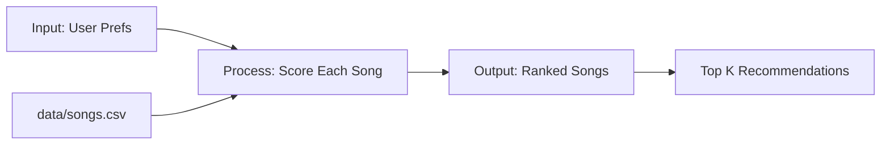

# 🎵 Music Recommender Simulation

## Project Summary

In this project you will build and explain a small music recommender system.

Your goal is to:

- Represent songs and a user "taste profile" as data
- Design a scoring rule that turns that data into recommendations
- Evaluate what your system gets right and wrong
- Reflect on how this mirrors real world AI recommenders

My version turns a small music catalog into ranked recommendations by comparing each song against a user taste profile. It starts with simple genre, mood, and energy matching, then extends the score with extra song attributes like popularity, era, mood tags, aggressiveness, synthiness, and nostalgia so the system can explain why a track moved up or down.

---

## How The System Works

Real-world recommender systems compare each item against a user's preferences, score every option, and then rank the full catalog to surface the best matches. My version will do the same on a small music catalog: it will compare each song to a user taste profile, reward strong matches on genre and mood, and use numeric similarity for energy so the model prefers songs near the user's target instead of simply picking the highest or lowest values.

### Data And Profile

The `Song` object now uses these features: genre, mood, energy, tempo_bpm, valence, danceability, acousticness, popularity, release_decade, mood_tag, aggressiveness, synthiness, and nostalgia_score. The basic `UserProfile` still stores favorite_genre, favorite_mood, target_energy, and likes_acoustic, but the CLI experiments also try extra preferences such as preferred_decade, desired_mood_tag, target_popularity, target_aggressiveness, likes_synth, and likes_nostalgia.

If I expand the dataset, I would ask Copilot to generate 5 to 10 new CSV rows that keep the same headers, add a mix of genres and moods not already in the starter file, and preserve valid numeric ranges for the 0.0 to 1.0 features.

### Algorithm Recipe

My first scoring rule will be simple and transparent:

- `+2.0` points for a genre match
- `+1.0` point for a mood match
- up to `+1.5` points for energy similarity, where closer to the user's `target_energy` gets more points
- a small bonus or penalty for acousticness depending on whether `likes_acoustic` is true
- optional minor adjustments from valence, danceability, and tempo_bpm if I need more detail later

This gives genre the strongest categorical weight, mood a smaller but still important role, and energy a continuous signal that can separate songs with the same label but different feel. The newer attributes add more targeted signals: era matching for decade preference, a mood-tag bonus for more specific vibe labels, popularity and aggressiveness matching, plus synth and nostalgia adjustments for the Retro Nostalgia experiment. That should help distinguish cases like intense rock versus chill lofi without making the profile so narrow that only one exact song can match.

### Loop And Ranking

The recommender will score one song at a time, then sort the full list by score. That matters because a scoring rule answers, “How good is this single song for this user?” while a ranking rule answers, “Which songs are best overall when compared together?” I need both steps because recommendation is not just measuring one item in isolation; it is choosing the strongest matches from many candidates.

### Flow Of Data



### Bias And Limits

This system might over-prioritize genre and mood, which could hide great songs that match the user's energy but not the exact label. It also reflects the taste assumptions in the starter dataset, so if the catalog is small or unbalanced, the recommendations will be narrow too.

### CLI Verification

The recommender was run from the terminal with multiple stress-test profiles so I could compare how the scoring logic behaved across different user tastes and conflicting preferences. The Retro Nostalgia profile is especially useful because it checks whether the newer attributes actually change the ranking for a user who wants a 1980s synthwave sound, a nostalgic mood tag, and stronger synth and nostalgia signals.

```text
Loaded songs: 10

Top recommendations:

1. Sunrise City - Score: 4.38
   Artist: Neon Echo
   Reasons:
   - genre match (+2.0)
   - mood match (+1.0)
   - energy close to target (+1.47)
   - less acoustic preference (-0.09)

2. Gym Hero - Score: 3.28
   Artist: Max Pulse
   Reasons:
   - genre match (+2.0)
   - energy close to target (+1.30)
   - less acoustic preference (-0.03)

3. Rooftop Lights - Score: 2.27
   Artist: Indigo Parade
   Reasons:
   - mood match (+1.0)
   - energy close to target (+1.44)
   - less acoustic preference (-0.17)

4. Night Drive Loop - Score: 1.31
   Artist: Neon Echo
   Reasons:
   - energy close to target (+1.42)
   - less acoustic preference (-0.11)

5. Storm Runner - Score: 1.28
   Artist: Voltline
   Reasons:
   - energy close to target (+1.33)
   - less acoustic preference (-0.05)
```

### Stress Test Screenshots

The screenshots below show the terminal output captured after running the recommender with the different profiles.


---

## Getting Started

### Setup

1. Create a virtual environment (optional but recommended):

   ```bash
   python -m venv .venv
   source .venv/bin/activate      # Mac or Linux
   .venv\Scripts\activate         # Windows
   ```

2. Install dependencies

   ```bash
   pip install -r requirements.txt
   ```

3. Run the app:

   ```bash
   python -m src.main
   ```

### Running Tests

Run the starter tests with:

```bash
pytest
```

You can add more tests in `tests/test_recommender.py`.

---

## Experiments You Tried

Use this section to document the experiments you ran. For example:

- What happened when you changed the weight on genre from 2.0 to 0.5
- What happened when you added tempo or valence to the score
- How did your system behave for different types of users

Weight shift experiment: I doubled the importance of energy and cut the genre bonus in half. The recommendations became more energy-driven, which moved several high-energy songs upward even when genre was not a strong match. For the small catalog in this project, the change made the lists look more different than more accurate, because the same high-energy songs still dominated several profiles.

Retro Nostalgia experiment: I added a profile that asks for synthwave, a moody but nostalgic vibe, 1980s-era music, and extra support for synth and nostalgia. This showed whether the new song attributes were doing real work instead of just sitting in the CSV. It also made the explanation strings more informative, because the recommender could point to era, mood tag, synthiness, and nostalgia instead of only the basic genre and energy signals.

---

## Limitations and Risks

Summarize some limitations of your recommender.

Examples:

- It only works on a tiny catalog
- It does not understand lyrics or language
- It might over favor one genre or mood

You will go deeper on this in your model card.

---

## Reflection

Read and complete `model_card.md`:

[**Model Card**](model_card.md)

Write 1 to 2 paragraphs here about what you learned:

- about how recommenders turn data into predictions
- about where bias or unfairness could show up in systems like this

